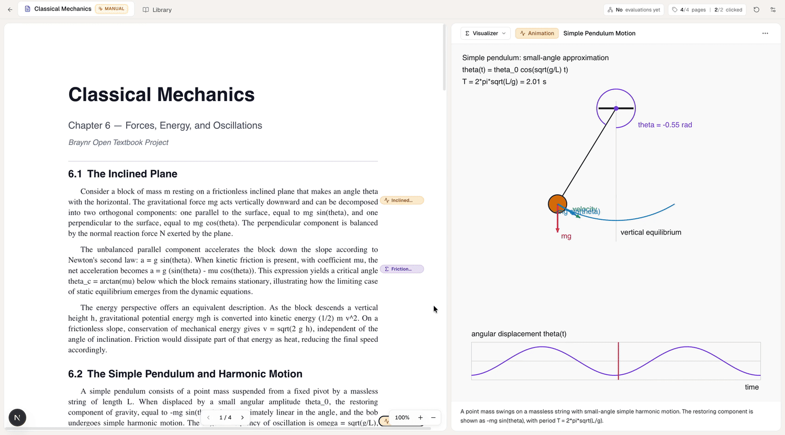

<div align="center">

# Get It

### Read it. See it. Get it.

**The study companion that turns a PDF into a measurable mastery map — built around the document, not in place of it.**

[](https://gdg.community.dev/)
[](https://braynr.com)
[](https://github.com/openai/codex)

[](https://nextjs.org)
[](https://react.dev)
[](https://www.typescriptlang.org)
[](https://tailwindcss.com)
[](https://threejs.org)
[](https://mozilla.github.io/pdf.js/)
[](#license)
[](#)

<br />



</div>

---

## Why Get It exists

Students already have the PDF. They don't need another summary. They need to **see** the parts of the document that text alone refuses to explain, and they need to **prove to themselves** that they have understood — concept by concept, not page by page. Today that proof is missing: flashcard ratings measure recall in the moment, mindmaps measure how much you drew, summaries measure how patient the AI was. None of these answer the only question that matters on exam day: *would I survive a question I have not seen before?*

Get It is the layer that answers it. Drop a PDF. Watch the document tag itself with the concepts that benefit from a picture; watch the right pane fill in with 3D models, animations, formulas with derivations, plotted graphs, and cited sources. Open the **Knowledge Graph**, see the document's own backbone laid out as a concept map, every node carrying four scores: **memory, comprehension, structure, application**. Talk to the document in **chat**. Run yourself through an **active-recall deck**. Or — the showpiece — explain a topic to a curious eight-year-old in a **Feynman session** and watch your mastery scores rise as you teach. Every interaction feeds one journal; one evaluator agent reads that journal and back-reflects four numbers per concept onto the graph. The student becomes visible to themselves.

> *"Their knowledge is so fragile."* — Richard Feynman, 1985.<br />
> *"What I cannot create, I do not understand."* — Richard Feynman, last blackboard at Caltech, 1988.

We took both lines literally.

## What it does

| | |
|---|---|
| 🎨 **Visualizer** | The right pane fills in by itself. Up to 4 concept visualizations render in parallel as the document is being read — Three.js scenes for anatomy and molecules, Canvas animations for inclined planes and pendulums, KaTeX for equations and step-by-step derivations, a plot engine for functions and distributions, cited markdown for legal articles and named statutes. |
| 🧭 **Knowledge Graph** | A concept map of the document, built once at upload by a dedicated kg-build agent. Nodes are sized by mastery, colored by progress, clickable for the four-axis breakdown plus the evaluator's per-concept note. The macro learning path is right there on screen. |
| 💬 **Chat** | Multi-turn, multi-thread Q&A grounded in the document. Every assistant reply triggers a debounced re-evaluation of the knowledge graph. |
| 🎴 **Flashcards** | AI-generated active-recall decks per topic. Type your answer, reveal, self-grade 1–4 (Again / Hard / Good / Easy, FSRS convention). Closing a deck triggers an evaluator pass. |
| 💡 **Feynman** | The agent plays a curious 8-year-old. *You* are the teacher. Three to four short, pointed prompts; you explain in plain words; the session ends with an honest summary of where the explanation held and where it broke down. The strongest signal we have for **comprehension**. |
| 📊 **Four-axis evaluator** | After every completed interaction, a dedicated agent reads the full work-context journal and updates per-node scores along four dimensions. Scores are **monotone non-decreasing** — the student can only progress, never regress. |
| 📥 **Your data, downloadable** | One click in the right-pane menu pulls the entire work-context JSON — every chat message, every card rating, every Feynman turn, every timestamp. The same file the evaluator reads. |

## Architecture in one breath

```
upload  ─┬──► visualizer pipeline ─► concept tags + 3D / anim / formula /
         │                            graph / cited-text spec, in parallel,
         │                            with auto-repair on runtime errors
         │
         └──► knowledge-graph pipeline ─► kg-build (once)  +
                                           kg-evaluate (debounced, after every
                                           tool interaction; per-doc queue;
                                           monotone clamp on every update)
```

Every agent — concept detection, visualization spec, kg-build, kg-evaluate, chat, flashcard generation, Feynman child, Feynman summary — is a single `codex exec` invocation through `@openai/codex-sdk`, constrained by a strict per-call JSON Schema. **Eight prompts behind one auth path. Eight schemas behind one shared SDK wrapper.** No god-prompt. No black box. The full architecture is in [`technical-writeup.md`](technical-writeup.md) (and [as a PDF](technical-writeup.pdf)).

## Run it locally

Get It runs on your machine, against your own Codex login, on your own PDFs. **Everything is real and works** — there is no hosted backend and no shared state. Three things are needed:

- **Node 20+**
- The **Codex CLI** authenticated against your ChatGPT or OpenAI API account: install [openai/codex](https://github.com/openai/codex), then run `codex login` once. That is the same login `@openai/codex-sdk` uses under the hood.
- A PDF with a real text layer (we do not OCR scans).

```bash
git clone https://github.com/beltromatti/braynr-hack-2026.git
cd braynr-hack-2026
npm install
cp .env.example .env        # tweak knobs if you want; defaults are fine
npm run generate-pdfs       # one-time: build 5 sample textbooks into public/pdfs/
npm run dev                 # http://localhost:3000
```

Open the page, drop a PDF (or click any sample). Tags appear inline as the document is being read. Click any tag to inspect the visualization, or use the dropdown in the right pane header to switch into the **Knowledge Graph**, **Chat**, **Flashcards**, or **Feynman** tools. The KG status badge in the top tab bar tells you when the evaluator is working and when the next sync just landed.

Two runtime knobs in the **Settings** popover (top-right cog) let you toggle auto-generation of visualizations and tune the visualizer's repair budget without restarting the server. They mirror `NEXT_PUBLIC_AUTO_GENERATE_VIZ` and `NEXT_PUBLIC_MAX_VIZ_GEN_RETRIES`.

## The team

Built in 24 hours at **GDG AI Hack 2026, Milan**, for the **Braynr** challenge.

- **Mattia Beltrami** — Politecnico di Milano
- **Matteo Impieri** — Politecnico di Milano
- **Filippo Difronzo** — Politecnico di Milano
- **Luca Feggi** — Università di Padova

## Want the deeper read

[`technical-writeup.md`](technical-writeup.md) — the full design rationale: the four-axis rubric, the per-doc evaluator queue, the parallel visualizer agents, the LLM-code sandbox, the work-context journal, the 14 lessons from learning research that shaped the UX. Also rendered as [`technical-writeup.pdf`](technical-writeup.pdf).

## License

MIT — see source files. Built for an open hackathon; do as you like with it.
